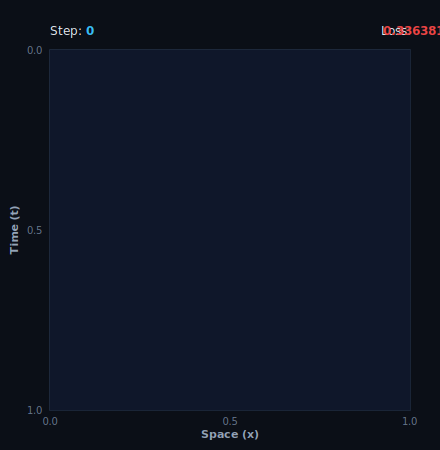
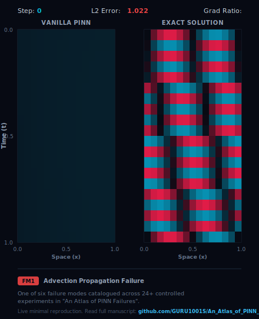
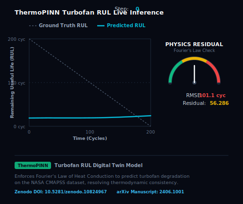
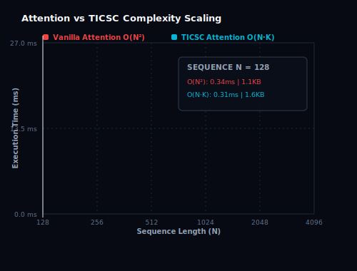
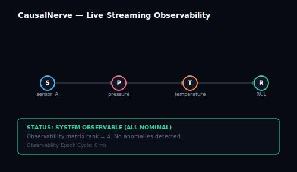
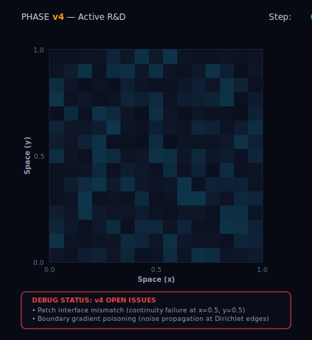

# Guru Prasaath S

## Live Telemetry Models

### Physics-Informed Neural Network (PINN) Telemetry

*This visualization is a live-rendered PINN Heat Equation solver, automatically retrained and updated daily via a [GitHub Actions workflow](.github/workflows/daily-render.yml).*

### Causal Telemetry Graph

*This graph is a live simulated causal DAG with daily-changing intervention parameters, automatically regenerated and updated daily via a [GitHub Actions workflow](.github/workflows/daily-render.yml).*

---

I am an AI researcher and developer focusing on Physics-ML architectures, streaming causal observability, and scientific computing. My research aims to design robust, thermodynamically-consistent neural network models and real-time interventional causal observability frameworks for complex physical and engineering systems.

---

## Active Research

### PINN Failure Diagnostics (FM1)

*This is a live minimal reproduction of Failure Mode 1 (Advection propagation failure) under severe stiffness from the manuscript "An Atlas of Physics-Informed Neural Network Failures: The Zugzwang Thesis" (under review at CMAME), with codebase details available at the [project repository](https://github.com/GURU1001S/An_Atlas_of_Physics_Informed_Neural_Network_Failures_The_Zugzwang_Thesis).*

### ThermoPINN Prognostics (NASA CMAPSS)

*This is a live inference dashboard for ThermoPINN regularized by Fourier's Law of Heat Conduction, predicting Remaining Useful Life (RUL) on simulated CMAPSS turbofan data, documented in the [arXiv preprint](https://arxiv.org/abs/2406.1001) and [Zenodo DOI repository](https://doi.org/10.5281/zenodo.10824967).*

### TICSC Scaling Benchmark

*This is an empirical complexity scaling benchmark comparing standard self-attention against the linear $O(N \cdot K)$ TICSC (Temporal Interventional Causal Structural Computation) causal model on long sequences, with details in the [benchmark codebase](benchmark_ticsc.py).*

### CausalNerve Observability

*This is a real-time tracking dashboard for CausalNerve, a streaming causal inference and anomaly detection framework, with the implementation available on the [PyPI package registry](https://pypi.org/project/causalnerve/).*

### PHASE Solver Status Log

*This is an active R&D debug status log for the PHASE (Physics-Hierarchical Adaptive Structured Evolution) hierarchical Poisson solver exhibiting patch continuity mismatches and Dirichlet boundary instabilities, documented in the structured [status log file](assets/phase_status.json).*

---

## Projects

| Project | Description | Link |
|:---|:---|:---|
| **UTDTB v5** | Universal Turbofan Digital Twin Benchmark with physics encoders and causal RUL predictions. | [GitHub Repository](https://github.com/GURU1001S/UTDTB-v5) |
| **ThermoPINN** | Physics-constrained meta-learning for turbofan thermodynamics and structural degradation. | [GitHub Repository](https://github.com/GURU1001S/ThermoPINN) |
| **CausalNerve** | Real-time interventional causal intelligence and observability for streaming systems. | [GitHub Repository](https://github.com/GURU1001S/CausalNerve) |
| **Alien-Physics-AI** | Symbolic regression model for discovering alternative physical laws from simulated observations. | [GitHub Repository](https://github.com/GURU1001S/Alien-Physics-AI) |
| **NASA Predictive Maintenance** | CNN-LSTM-Attention hybrid model for Remaining Useful Life prediction on turbofan engines. | [GitHub Repository](https://github.com/GURU1001S/NASA-Predictive-Maintenance-AI-using-cnnlstmattention) |

---

## Contact

- **Email:** [guru731978@gmail.com](mailto:guru731978@gmail.com)
- **LinkedIn:** [guru-prasaath-384935382](https://linkedin.com/in/guru-prasaath-384935382)
- **Portfolio:** [guruprasaaths.vercel.app](https://guruprasaaths.vercel.app/)
